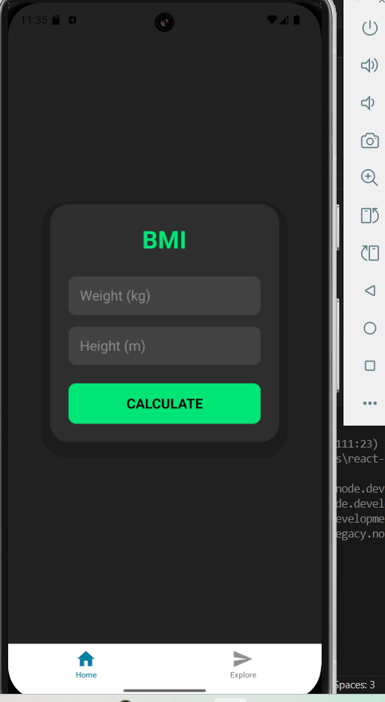

# BMI Calculator
In this guided practice, you will create a simple Android application using React Native that
calculates a person’s Body Mass Index (BMI) based on their weight and height. The application
will also display the BMI category (e.g., Underweight, Normal, Overweight, Obese).

